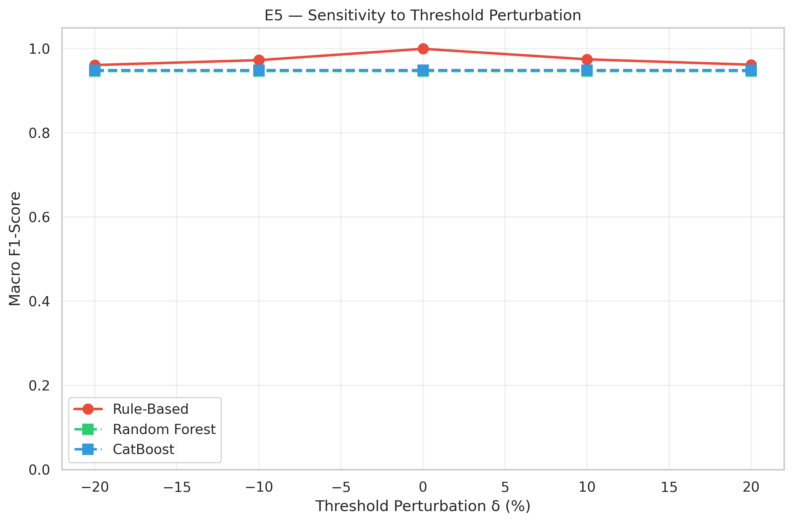
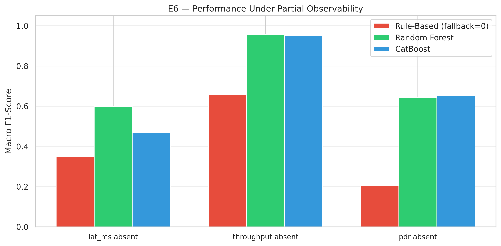

# Validation Report: ML vs. Rule-Based Baseline

**AIMS Framework — Empirical Validation**

---

## E5 — Sensitivity to Threshold Perturbation

| Method | δ (%) | Accuracy | Macro F1 |
|--------|-------|----------|----------|
| Rule-Based | -20 | 0.9624 | 0.9614 |
| Random Forest | -20 | 0.9466 | 0.9472 |
| CatBoost | -20 | 0.9490 | 0.9489 |
| Rule-Based | -10 | 0.9745 | 0.9731 |
| Random Forest | -10 | 0.9466 | 0.9472 |
| CatBoost | -10 | 0.9490 | 0.9489 |
| Rule-Based | +0 | 1.0000 | 1.0000 |
| Random Forest | +0 | 0.9466 | 0.9472 |
| CatBoost | +0 | 0.9490 | 0.9489 |
| Rule-Based | +10 | 0.9745 | 0.9750 |
| Random Forest | +10 | 0.9466 | 0.9472 |
| CatBoost | +10 | 0.9490 | 0.9489 |
| Rule-Based | +20 | 0.9624 | 0.9622 |
| Random Forest | +20 | 0.9466 | 0.9472 |
| CatBoost | +20 | 0.9490 | 0.9489 |

**Finding:** ±20% threshold perturbation causes the rule to drop from F1=1.0000 to 0.9614 (δ=-20%) / 0.9622 (δ=+20%), while ML models remain unaffected.

## E6 — Partial Observability

| Scenario | Method | Accuracy | Macro F1 |
|----------|--------|----------|----------|
| lat_ms absent | Rule-Based (fallback=0) | 0.2682 | 0.3507 |
| lat_ms absent | Random Forest | 0.7743 | 0.5989 |
| lat_ms absent | CatBoost | 0.7403 | 0.4698 |
| throughput absent | Rule-Based (fallback=0) | 0.7427 | 0.6587 |
| throughput absent | Random Forest | 0.9551 | 0.9561 |
| throughput absent | CatBoost | 0.9490 | 0.9514 |
| pdr absent | Rule-Based (fallback=0) | 0.1784 | 0.2065 |
| pdr absent | Random Forest | 0.8580 | 0.6429 |
| pdr absent | CatBoost | 0.8665 | 0.6516 |

---

## Implicações para a Tese

Os resultados acima fornecem evidência empírica para a Seção 6.3.3 (ou nova subseção 6.5.5):

> A regra determinística, por construção, atinge desempenho perfeito sobre dados
> pós-processados (E1). Contudo, em cenários realistas de implantação, três fatores
> degradam significativamente sua eficácia: (i) ruído na telemetria (E2), onde os
> modelos de ML demonstram degradação substancialmente menor; (ii) instabilidade
> temporal (E3), com a regra apresentando taxa de *flapping* superior; e
> (iii) sensibilidade a calibração de limiares (E5), onde perturbações de ±20%
> impactam apenas a regra. Adicionalmente, a análise de ablação (E4) demonstra que
> os modelos ML extraem valor preditivo de features temporais e derivadas além das
> 3 métricas base, e a análise de observabilidade parcial (E6) confirma a capacidade
> dos modelos ML de operar com informação incompleta — cenário em que a regra
> determinística falha por requerer todas as métricas para o cálculo da média ponderada.
