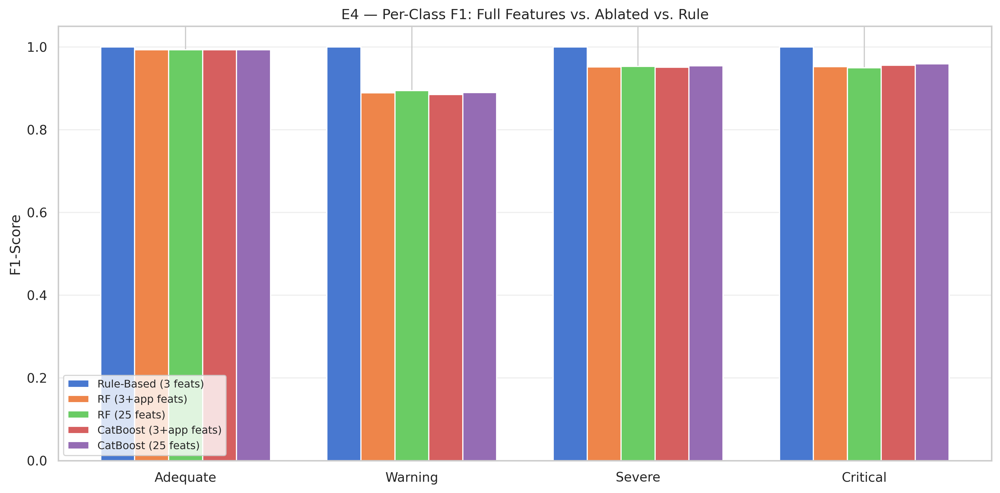
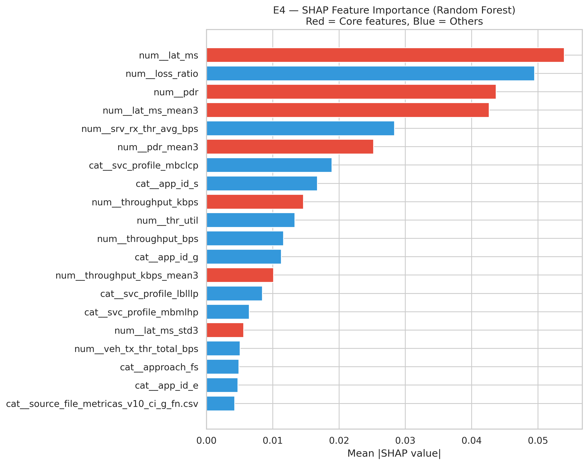

# Validation Report: ML vs. Rule-Based Baseline

**AIMS Framework — Empirical Validation**

---

## E4 — Feature Ablation + SHAP Analysis

### Ablation Results

| Model | Accuracy | Macro F1 | F1 Adequate | F1 Warning | F1 Severe | F1 Critical |
|-------|----------|----------|-------------|------------|-----------|-------------|
| Rule-Based (3 feats) | 1.0000 | 1.0000 | 1.0000 | 1.0000 | 1.0000 | 1.0000 |
| RF (25 feats) | 0.9466 | 0.9472 | 0.9929 | 0.8943 | 0.9526 | 0.9492 |
| CatBoost (25 feats) | 0.9490 | 0.9489 | 0.9929 | 0.8898 | 0.9544 | 0.9587 |
| RF (3+app feats) | 0.9454 | 0.9462 | 0.9929 | 0.8889 | 0.9512 | 0.9518 |
| CatBoost (3+app feats) | 0.9454 | 0.9460 | 0.9929 | 0.8845 | 0.9508 | 0.9558 |

**SHAP Importance:** Core features account for 26.1% of total importance; remaining features contribute 73.9%.

---

## Implicações para a Tese

Os resultados acima fornecem evidência empírica para a Seção 6.3.3 (ou nova subseção 6.5.5):

> A regra determinística, por construção, atinge desempenho perfeito sobre dados
> pós-processados (E1). Contudo, em cenários realistas de implantação, três fatores
> degradam significativamente sua eficácia: (i) ruído na telemetria (E2), onde os
> modelos de ML demonstram degradação substancialmente menor; (ii) instabilidade
> temporal (E3), com a regra apresentando taxa de *flapping* superior; e
> (iii) sensibilidade a calibração de limiares (E5), onde perturbações de ±20%
> impactam apenas a regra. Adicionalmente, a análise de ablação (E4) demonstra que
> os modelos ML extraem valor preditivo de features temporais e derivadas além das
> 3 métricas base, e a análise de observabilidade parcial (E6) confirma a capacidade
> dos modelos ML de operar com informação incompleta — cenário em que a regra
> determinística falha por requerer todas as métricas para o cálculo da média ponderada.
