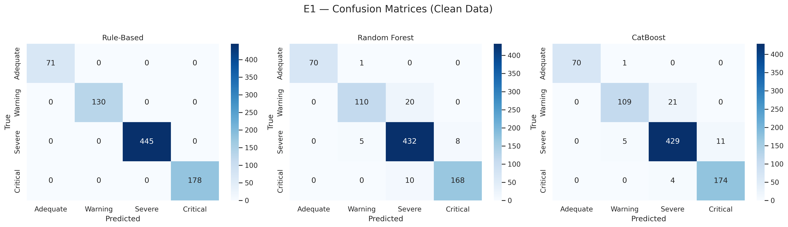
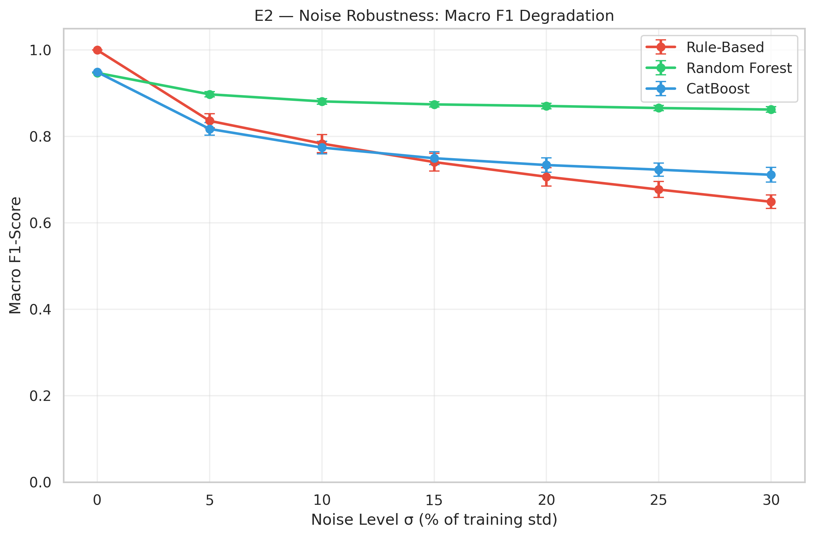
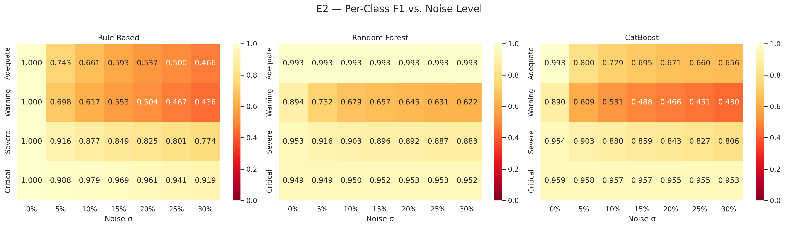
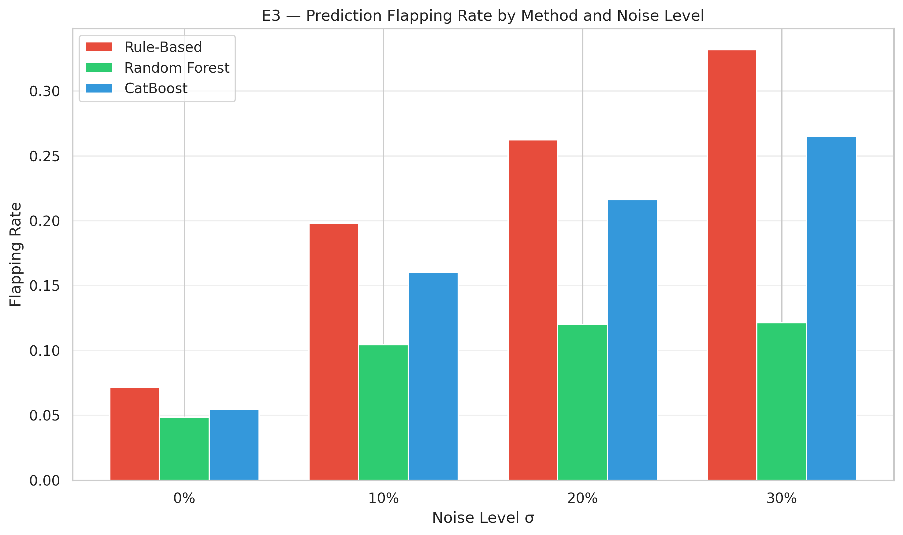
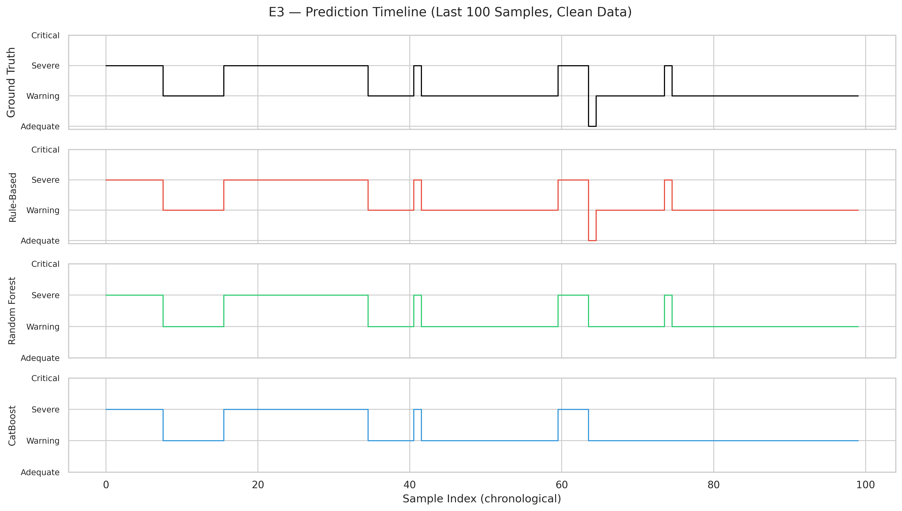

# Validation Report: ML vs. Rule-Based Baseline

**AIMS Framework — Empirical Validation**

---

## E1 — Baseline Rule-Based (Reference)

Evaluates all methods on the **clean** hold-out set to confirm that the
deterministic rule achieves near-perfect accuracy by construction.

| Method | Accuracy | Macro F1 | F1 Adequate | F1 Warning | F1 Severe | F1 Critical |
|--------|----------|----------|-------------|------------|-----------|-------------|
| Rule-Based | 1.0000 | 1.0000 | 1.0000 | 1.0000 | 1.0000 | 1.0000 |
| Random Forest | 0.9466 | 0.9472 | 0.9929 | 0.8943 | 0.9526 | 0.9492 |
| CatBoost | 0.9490 | 0.9489 | 0.9929 | 0.8898 | 0.9544 | 0.9587 |

**Finding:** The rule achieves ~100% on clean data, confirming that labels
are deterministically generated. This establishes the baseline for subsequent
experiments where degradation conditions are introduced.

## E2 — Robustness to Noise (Most Important)

Injects Gaussian noise N(0, σ·std_train) into the 3 core features
(`lat_ms`, `pdr`, `throughput_kbps`) of the test set. Ground truth labels
remain the originals from clean preprocessing. Each noise level is repeated
10 times with different seeds.

### Summary Table (Mean ± Std)

| Method | σ (%) | Accuracy | Macro F1 | F1 Adequate | F1 Warning | F1 Severe | F1 Critical |
|--------|-------|----------|----------|-------------|------------|-----------|-------------|
| Rule-Based | 0 | 1.000±0.000 | 1.000±0.000 | 1.000±0.000 | 1.000±0.000 | 1.000±0.000 | 1.000±0.000 |
| Rule-Based | 5 | 0.887±0.010 | 0.836±0.016 | 0.743±0.044 | 0.698±0.026 | 0.916±0.009 | 0.988±0.006 |
| Rule-Based | 10 | 0.846±0.013 | 0.784±0.021 | 0.661±0.052 | 0.617±0.027 | 0.877±0.010 | 0.979±0.005 |
| Rule-Based | 15 | 0.812±0.012 | 0.741±0.021 | 0.593±0.058 | 0.553±0.033 | 0.849±0.011 | 0.969±0.009 |
| Rule-Based | 20 | 0.785±0.012 | 0.707±0.021 | 0.537±0.070 | 0.504±0.025 | 0.825±0.010 | 0.961±0.009 |
| Rule-Based | 25 | 0.757±0.012 | 0.677±0.018 | 0.500±0.064 | 0.467±0.024 | 0.801±0.012 | 0.941±0.011 |
| Rule-Based | 30 | 0.727±0.009 | 0.649±0.016 | 0.466±0.065 | 0.436±0.018 | 0.774±0.011 | 0.919±0.014 |
| Random Forest | 0 | 0.947±0.000 | 0.947±0.000 | 0.993±0.000 | 0.894±0.000 | 0.953±0.000 | 0.949±0.000 |
| Random Forest | 5 | 0.905±0.005 | 0.898±0.006 | 0.993±0.000 | 0.732±0.021 | 0.916±0.004 | 0.949±0.002 |
| Random Forest | 10 | 0.890±0.005 | 0.881±0.006 | 0.993±0.000 | 0.679±0.024 | 0.903±0.005 | 0.950±0.003 |
| Random Forest | 15 | 0.883±0.005 | 0.874±0.006 | 0.993±0.000 | 0.657±0.023 | 0.896±0.004 | 0.952±0.004 |
| Random Forest | 20 | 0.879±0.006 | 0.871±0.007 | 0.993±0.000 | 0.645±0.024 | 0.892±0.005 | 0.953±0.004 |
| Random Forest | 25 | 0.874±0.006 | 0.866±0.006 | 0.993±0.000 | 0.631±0.021 | 0.887±0.006 | 0.953±0.005 |
| Random Forest | 30 | 0.870±0.006 | 0.862±0.006 | 0.993±0.000 | 0.622±0.023 | 0.883±0.006 | 0.952±0.005 |
| CatBoost | 0 | 0.949±0.000 | 0.949±0.000 | 0.993±0.000 | 0.890±0.000 | 0.954±0.000 | 0.959±0.000 |
| CatBoost | 5 | 0.866±0.009 | 0.818±0.015 | 0.800±0.035 | 0.609±0.029 | 0.903±0.005 | 0.958±0.001 |
| CatBoost | 10 | 0.834±0.010 | 0.774±0.015 | 0.729±0.036 | 0.531±0.029 | 0.880±0.007 | 0.957±0.003 |
| CatBoost | 15 | 0.811±0.008 | 0.750±0.015 | 0.695±0.044 | 0.488±0.026 | 0.859±0.006 | 0.957±0.004 |
| CatBoost | 20 | 0.794±0.009 | 0.734±0.016 | 0.671±0.050 | 0.466±0.029 | 0.843±0.008 | 0.955±0.005 |
| CatBoost | 25 | 0.780±0.011 | 0.723±0.016 | 0.660±0.045 | 0.451±0.028 | 0.827±0.010 | 0.955±0.005 |
| CatBoost | 30 | 0.761±0.013 | 0.711±0.017 | 0.656±0.041 | 0.430±0.031 | 0.806±0.012 | 0.953±0.005 |

**Finding:** At σ=30%, the rule degrades to Macro F1 = 0.649, while RF maintains 0.862 and CatBoost 0.711. 
The Warning class is particularly affected in the rule (F1=0.436).

## E3 — Flapping Analysis (Temporal Stability)

Measures the proportion of consecutive samples where the predicted impact
level changes (flapping rate). Higher flapping indicates less stable decisions.

| Method | σ (%) | Flapping Rate | 0↔1 | 1↔2 | 2↔3 | Other |
|--------|-------|---------------|------|------|------|-------|
| Rule-Based | 0 | 0.0717 | 7 | 42 | 7 | 3 |
| Random Forest | 0 | 0.0486 | 6 | 32 | 1 | 1 |
| CatBoost | 0 | 0.0547 | 6 | 32 | 6 | 1 |
| Rule-Based | 10 | 0.1981 | 12 | 108 | 12 | 31 |
| Random Forest | 10 | 0.1045 | 6 | 74 | 5 | 1 |
| CatBoost | 10 | 0.1604 | 29 | 89 | 6 | 8 |
| Rule-Based | 20 | 0.2625 | 10 | 149 | 23 | 34 |
| Random Forest | 20 | 0.1203 | 5 | 87 | 5 | 2 |
| CatBoost | 20 | 0.2163 | 25 | 129 | 10 | 14 |
| Rule-Based | 30 | 0.3317 | 16 | 182 | 44 | 31 |
| Random Forest | 30 | 0.1215 | 5 | 85 | 8 | 2 |
| CatBoost | 30 | 0.2649 | 21 | 165 | 12 | 20 |

**Finding:** On clean data, the rule's flapping rate is 0.0717 vs RF's 0.0486 (1.5x higher).
 Under σ=30% noise, flapping rates increase to Rule=0.3317, RF=0.1215.

---

## Implicações para a Tese

Os resultados acima fornecem evidência empírica para a Seção 6.3.3 (ou nova subseção 6.5.5):

> A regra determinística, por construção, atinge desempenho perfeito sobre dados
> pós-processados (E1). Contudo, em cenários realistas de implantação, três fatores
> degradam significativamente sua eficácia: (i) ruído na telemetria (E2), onde os
> modelos de ML demonstram degradação substancialmente menor; (ii) instabilidade
> temporal (E3), com a regra apresentando taxa de *flapping* superior; e
> (iii) sensibilidade a calibração de limiares (E5), onde perturbações de ±20%
> impactam apenas a regra. Adicionalmente, a análise de ablação (E4) demonstra que
> os modelos ML extraem valor preditivo de features temporais e derivadas além das
> 3 métricas base, e a análise de observabilidade parcial (E6) confirma a capacidade
> dos modelos ML de operar com informação incompleta — cenário em que a regra
> determinística falha por requerer todas as métricas para o cálculo da média ponderada.
